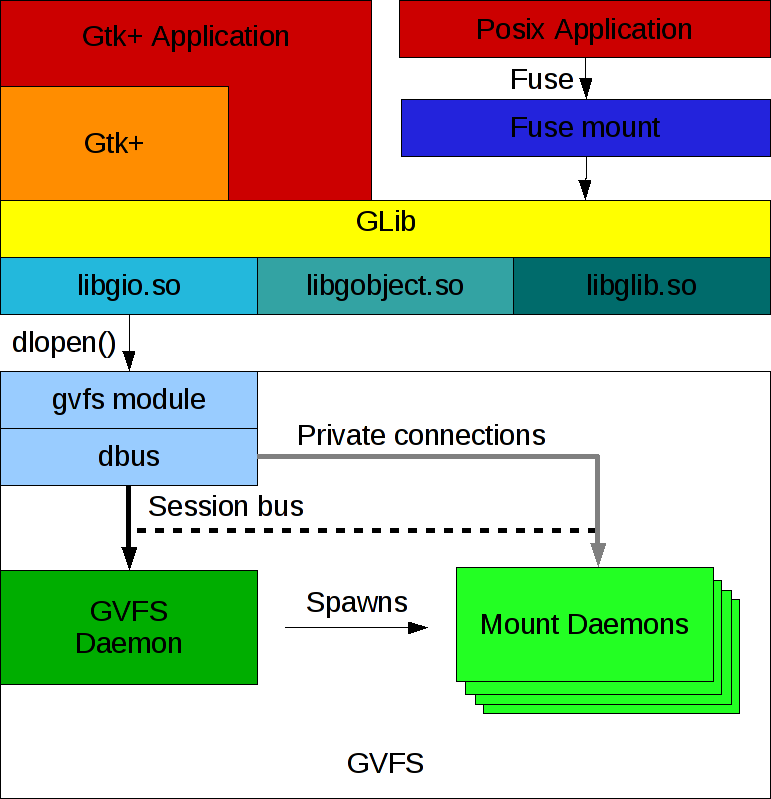

# Demo 小例子索引

### [PAM](pam/README.md) 

> PAM服务端模块开发和PAM应用层开发

- 目前学习进度

    - [x] 熟悉PAM配置
    - [x] 服务端模块开发
    - [x] 应用端开发
    - [x] PAM服务端与应用端交互例子
    - [ ] PAM服务端密码验证
    - [ ] PAM应用层解析服务端返回的提示信息

- 例子说明

    | 例子 | 例子说明 |
    | --- | --- |
    | [pam_module_mypasswd1.c](pam/pam_module_mypasswd1.c) | PAM服务端模块密码验证 |
    | [pam_test_mypasswd1.c](pam/pam_test_mypasswd1.c) | PAM应用层密码验证调用 |
    | [pam_module_conversation.c](pam/pam_module_conversation.c) | PAM服务端模块返回交互信息 |
    | [pam_test_conversation.c](pam/pam_test_conversation.c) | PAM应用层验证例子(可交互) |

### xlib

1. 服务器将用户输入分配到位于同一台计算机上或网络中其他位置的各种客户端程序，并接受来自这些客户端程序的输出请求, Xlib的是ç子例程库，应用程序（客户端）使用它来通过流连接与窗口系统进行接口。
2. 单个X服务器可以为任意数量的屏幕提供显示服务
3. 单个用户使用一个键盘和一个指针（通常是鼠标）的一组屏幕称为显示器
4. X服务器中的所有窗口都按严格的层次结构排列。每个层次结构的顶部是一个根窗口，该窗口覆盖了显示屏。根窗口又被子窗口覆盖。除了根窗口，每个窗口都有父窗口

### 需要编译安装的内容

1. glib `glib-2.63.3`
    
    tar xvf glib-2.63.3 && mkdir glib && cd glib && meson ../glib-2.63.3 && meson install 

## GIO

#### 工具 —— gio-querymodules

#### 工具 —— gsettings

> 用来获取和修改键值，大多数命令需要 `SCHEMA` 和 `KEY` 来操作值。 当 `SCHEMA` 不在固定目录目录下时，`SCHEMA`需要一个`:PATH`后缀
> gsetting 需要一个D-Bus会话总线连接来将更改写入dconf数据库

```shell
    gsettings get SCHEMA [:PATH] KEY
    gsettings monitor SCHEMA [:PATH] [KEY]
    gsettings writable SCHEMA [:PATH] KEY
    gsettings range SCHEMA [:PATH] KEY
    gsettings describe SCHEMA [:PATH] KEY
    gsettings set SCHEMA [:PATH] KEY VALUE
    gsettings reset SCHEMA [:PATH] KEY
    gsettings reset-recursively SCHEMA [:PATH]
    gsettings list-schemas [--print-paths]
    gsettings list-relocatable-schemas
    gsettings list-keys SCHEMA [:PATH]
    gsettings list-children SCHEMA [:PATH]
    gsettings list-recursively [SCHEMA [:PATH]]
    gsettings help [COMMAND]
```

#### 工具 —— glib-compile-schemas

> 将目录中所有GSettings XML 模式文件编译成一个名为gshema.compile的二进制文件，GSettings可以使用这个文件。
> 要编译的 XML 文件必须由扩展名
> 该工具检查 `XDG_DATA_DIRS` 环境变量中指定的所有目录的 `glib-2.0/schemas`，一般路径是 `/usr/share/glib2.0/schemas`
> 扩展名`gshema.override`中的键值覆盖默认的键值，要覆盖的文件以`nn_`开头，数字越大优先级越高

```shell
    帮助选项：
    -h, --help                显示帮助选项

    应用程序选项：
    --version                 显示程序版本并退出
    --targetdir=DIRECTORY     Where to store the gschemas.compiled file
    --strict                  在方案出现任何错误时中止
    --dry-run                 不要对 gschema.compiled 进行写操作
    --allow-any-name          不要强制键名的限制
```

#### 工具 —— glib-compile-resources

> 从文件及其引用的文件中读取资源描述，并创建适合与GResource API 一起使用的二进制资源包。然后按原样或作为链接到应用程序的C源代码写出结果包。

```shell
    用法：
        glib-compile-resources [OPTION…] FILE

        将一份资源规格编译为资源文件。
        资源规格文件以 .gresource.xml 为扩展名，
        资源文件以 .gresource 为扩展名。

    帮助选项：
        -h, --help                   显示帮助选项

    应用程序选项：
        --version                    显示程序版本并退出
        --target=FILE                Name of the output file
        --sourcedir=DIRECTORY        The directories to load files referenced in FILE from (default: current directory)
        --generate                   以目标文件扩展名所选择的格式生成输出
        --generate-header            生成源码头文件
        --generate-source            Generate source code used to link in the resource file into your code
        --generate-dependencies      生成依赖关系列表
        --dependency-file=FILE       Name of the dependency file to generate
        --generate-phony-targets     Include phony targets in the generated dependency file
        --manual-register            Don’t automatically create and register resource
        --internal                   Don’t export functions; declare them G_GNUC_INTERNAL
        --external-data              Don’t embed resource data in the C file; assume it's linked externally instead
        --c-name                     用于生成的源代码的 C 标识符名称
```

#### 工具 —— gdbus

> 处理D-Bus对象的工具

```shell
    用法：
        gdbus COMMAND

    Commands:
        help         Shows this information
        introspect   Introspect a remote object
        monitor      Monitor a remote object
        call         Invoke a method on a remote object
        emit         Emit a signal
        wait         Wait for a bus name to appear
```

#### 工具 —— gdbus-codegen

> dbus 代码和文档生成器

#### 工具 —— gresource

> 提供了一个简单的命令行接口，允许列出并提取已编译到资源文件或包含在elf文件（二进制文件或共享库）中的资源
> 如果一个elf文件中包含多个带有资源的 section，那么可使用 `--section`查找可用的 `section`

```shell
    list        Lists resources. If SECTION is given, only list resources in this section. If PATH is given, only list matching resources.
    details     Lists resources with details. If SECTION is given, only list resources in this section. If PATH is given, only list matching resources. Details include the section, size and compression of each resource.
    extract     Extracts the resource named by PATH to stdout. Note that resources may contain binary data.
    sections    Lists sections containing resources. This is only interesting if FILE is an elf file.
    help        Prints help and exits.
```

#### 工具 —— gapplication

> 是`org.freedesktop.Application`接口的命令行实现，由 `freedesktop.org`桌面条目规范指定。
> gapplication可用于启动在`.desktop`文件中将`DBusActivatable`设置为`true`的应用程序，并可用于向其它应用程序已经运行的实例发送消息
> 程序可用在其`.desktop`文件的Exec中引用`gapplication`，来兼容不直接支持`DBusActivitable`的程序

```shell
    用法：

        gapplication COMMAND [ARGS…]

    命令：
        help           打印帮助
        version        打印版本
        list-apps      列出应用程序
        launch         启动一个应用程序
        action         激活一个动作
        list-actions   列出可用动作
```

#### 工具 —— gio

```shell
    help     打印帮助
    version  打印版本
    cat      串接文件，写到标准输出
    copy     复制文件
    info     显示关于位置的信息
    list     列出某位置的内容
    mime     获取或设置某种 MIME 类型的处理程序
    mkdir    创建目录
    monitor  监视文件和目录更改
    mount    挂载或卸载位置
    move     移动文件
    open     用默认应用打开文件
    rename   重命名文件
    remove   删除文件
    save     从标准输入读取并保存
    set      设置文件属性
    trash    移动文件或目录到回收站
    tree     在树中列出某位置的内容
```

#### GIO

> GIO正在努力为桌面应用程序（如网络和D-Bus支持）提供一个现代的、易于使用的VFS API，它位于库堆栈的正确级别。目标是克服GnomeVFS的缺点，并提供一个非常好的API，使得开发人员更喜欢它而不是原始的POSIX调用。其中包括使用GObject。它还意味着不克隆POSIX API，而是提供更高级别的、以文档为中心的接口。 

1. GIO的抽象文件系统模型由许多I/O和文件的接口和基类组成： 

    - GFile  对文件的引用 (文件、文件夹的检测、创建、删除、修改信息、打开、关闭、复制、路径操作、挂载相关、文件类型、byte load)
    - GFileInfo  文件或文件系统相关的信息（类型、是否隐藏、是否可读写执行等、是否可重命名、是否可挂载、是否unix设备、修改时间参数、uid、gid、归属用户和组...）
    - GFileAttribute key-value形式的文件属性（GFileInfo会返回这种类型）
    - GFileEnumerator 列出文件夹中的文件（对一组GFiles进行操作，为每个枚举的文件返回GFileInfo结构 -- 关联了 GFile 和 GFileInfo）
    - GDrive 表示驱动器 (来源于 GVolumeMonitor)
    - GVolume 表示文件系统 （来源于 GVolumeMonitor）
    - GMount 表示已挂载的文件系统（来源于 GVolumeMontor 名字、uuid、图标相关，由GFile得到）

2. 输入输出流

    - GInputStream 读取数据
    - GOutputStream 写数据
    - GIOStream 读/写数据
    - GSeekable 流定位

3. 应用程序及处理文件类型相关的接口

    - GAppinfo 有关已安装应用程序的信息
    - GIcon 文件和应用程序图标的抽象类型

4. 用于存储和检索应用程序设置的框架

    - GSetting 存储和检索应用程序设置

5. 网络编程、连接监控、名称解析、低级套接字API和高级客户端、高级帮助类

    - GSocket 底层平台无关的套接字
    - Gresolver 异步和可取消的DNS解析器
    - GSocketClient 高级别的网络客户端
    - GSocketService 高级别的网络服务端
    - GSocketConnection 网络连接流
    - GNetworkMonitor 网络连接监控

6. 连接到D-Bus，发送和接收信息，监视总线名称和使对象在总线上可用

    - GDBusConnection D-Bus连接
    - GDbusMethodInvocation 处理远程呼叫
    - GDBusServer 接受连接
    - GDBusProxy 远程对象接入D-Bus接口的代理



#### GIOModule

> 提供用于加载和卸载模块的接口和默认函数。这在内部用于使GIO可扩展，但也可以被其他人用于实现模块加载。

#### POSIX和GIO对比

| POSIX | GIO |
| --- | --- |
| `POSIX` | `GIO` |
| `char *path` | `GFile *file` |
| `struct stat *buf` | `GFileInfo *info` |
| `struct statvfs *buf` | `GFileInfo *info` |
| `int fd` | `GInputStream *in` 与 `GOutputStream *out` |
| `DIR *` | `GFileEnumerator *enum` |
| `fstab entry` | `GUnixMountPoint *mount_point` |
| `mtab entry` | `GUnixMountEntry *mount_entry` |

#### GnomeVFS与GIO对比

| `Gnome_VFS` | `GIO` |
| --- | --- |
| `GnomeVFSUR` | `GFile` |
| `GnomeVFSFileInfo` | `GFileInfo` |
| `GnomeVFSResult` | `GError, with G_IO_ERROR values` |
| `GnomeVFSHandle & GnomeVFSAsyncHandle` | `GInputStream or GOutputStream` |
| `GnomeVFSDirectoryHandle` | `GFileEnumerator` |
| `mime type` | `content type` |
| `GnomeVFSMonitor` | `GFileMonitor` |
| `GnomeVFSVolumeMonitor` | `GVolumeMonitor` |
| `GnomeVFSVolume` | `GMount` |
| `GnomeVFSDrive` | `GVolume` |
| `-` | `GDrive` |
| `GnomeVFSContext` | `GCancellable` |
| `gnome_vfs_async_cancel` | `g_cancellable_cancel` |

## IPC

### dbus 例子

| 例子 | 说明 |
| --- | --- |
| `dbus-own-name.c` | 在DBus上注册一个名字 |
| `dbus-watch-name.c` | 在dbus的会话总线上检测指定名字的总线是否存在 |

#### 概念介绍

- dbus-daemon 一个dbus的后台守护程序，用于多应用之间消息转发
- libdbus.so dbus的功能接口
- 高层封装，如dbus-glib和QT D-bus
- dbus总线一般分为系统总线和会话总线，所以安全性很好
- dbus支持进程间一对一和一对多的对等通信
- 一个进程发送给另一个进程信息的时候，先是发给后台，由后台转发到另一个/多个进程
- dbus 可以代表其它应用程序启动程序（服务），应用程序要求dbus通过其名称启动服务，该名称必须是已知的，dbus查找的服务描述文件通常安装在`/usr/share/dbus-1/services/`扩展名位`.service`

> 官网中的dubs安装值包含上述1和2

1. 运行一个dbus-daemon就是创建了一条通信的总线Bus，当一个application链接到这条Bus上时，就产生了一个Connection
2. 从dbus 的概念上说，通信的双方是Object，一个application可以包含多个Object
3. 一个Object中会有不同的Interface，Interface可以看作是要传输的数据
4. dbus的两种通信方式：
  
  1. signal: 也就是广播
  2. method: 是一对一通信。

5. dbus应用场景

  1. 函数调用：DBus可用实现进程间函数调用，进程A发送函数调用强求，经过总线转发至进程B。进程B将应答函数返回值或错误消息
  2. 消息广播：进程间消息广播不需要响应，接收方需要向总线注册感兴趣的消息类型，当总线接受到"Signal消息"类型的消息时，会将消息转发至希望接受的进程。

6. 程序中的各个元素

  1. address: 用来标识ibus-daemon，格式:`unix:path=/var/run/dbus/xxxx`，service中使用
  2. bus name: 用来标识application的，格式：`com.xxx.xxx`
  3. path: 用于标识Object，格式：`/xxx/xxx/xxx`
  4. name: 每个interface都有自己的名字，通过interface的名字找到interface，格式：`xxx.xxx.xxx.xxx`
  5. signal 和 method也有自己的名字，随便取名就行

7. 术语

  1. connection: 用于打开到守护进程的连接的结构，可以通过指定`DBUS_BUS_SYSTEM`来打开系统总线守护进程，也可以使用`DBUS_BUS_SESSION`来打开会话总线守护进程。
  2. message: 是两个进程之间的一条消息，所有的DBus内部通信都是使用DBus消息完成的，这些消息可以有以下类型，方法调用，方法返回，信号，和错误。DBusMessage结构可以通过附加布尔整数、实数、字符串、数组、…到消息。
  3. path: 是远程对象的路径，如: /org/freedesktop/DBus.
  4. interface:是要与之对话的给定对象上的接口。
  5. signal:用来发出信号
  6. method call: 它是用于调用远程对象上的方法的DBus消息。
  7. Error: DBusError是通过调用DBus方法来保存错误代码的结构。

#### 使用

- DBus主要概念为总线，连接到总线的进程可以通过总线接收或传递消息，总线收到消息时，根据不同的消息类型进行不同的处理。DBus消息分为以下四类：

    1. Methodcall消息：将触发一个函数调用
    2. Methodreturn消息：触发函数调用返回的结果
    3. Error消息：触发的函数调用返回一个异常
    4. Signal消息：通知，可用看作为事件消息

1. dbus 注释

> dbus注释可用到 method、interface、property、signal、argument 元素，用于产生元信息键值对，具体注释有以下几种：

| 注释名称 | 注释可选值 | 注释值含义 |
| -- | -- | -- |
| org.freedesktop.DBus.Deprecated | true,false | 实体是否已弃用，默认false |
| org.freedesktop.DBus.GLib.CSymbol | (string) | c 符号，用于方法和接口 |
| org.freedesktop.DBus.Method.NoReply | true,false | true不希望回复方法调用，默认false |
| org.freedesktop.DBus.Property.EmitsChangedSignal | true,invalidates,const,false | false:属性发生改变，则不保证发出该信号；const:属性在其所属对象生存期内不会更改值，不会发送信号；invalidates:会发出信号，但不包含值；true:会发出包含值的信号；默认true |

``` <annotation name="org.freedesktop.DBus.Deprecated" value="true"/> ```

2. dbus XML节点
    
    1. <node>: 仅仅root节点可以省略 name,如果根设置了name属性，那值必须是绝对路径；如果子节点具有对象路径，则它们必须是相对的。
    2. <arg>: arg上的direction元素可省略，在这种情况下，方法调用默认为"in"，信号默认为"out"。信号只允许"out"，所以虽然可指定方向，但没有意义。只有这两值
    3. <property>: 允许的属性值为 "readwrite", "read", "write"
    4. <arg>:arg的name属性是可选的
    5. 多个 <interface> 可用列入一个<node>

``` xml
<!DOCTYPE node PUBLIC "-//freedesktop//DTD D-BUS Object Introspection 1.0//EN" "http://www.freedesktop.org/standards/dbus/1.0/introspect.dtd">
    <node name="/com/example/sample_object0">
        <interface name="com.example.SampleInterface0">
            <method name="Frobate">
                <arg name="foo" type="i" direction="in"/>
                <arg name="bar" type="s" direction="out"/>
                <arg name="baz" type="a{us}" direction="out"/>
                <annotation name="org.freedesktop.DBus.Deprecated" value="true"/>
            </method>
            <method name="Bazify">
                <arg name="bar" type="(iiu)" direction="in"/>
                <arg name="bar" type="v" direction="out"/>
            </method>
            <method name="Mogrify">
                <arg name="bar" type="(iiav)" direction="in"/>
            </method>
            <signal name="Changed">
                <arg name="new_value" type="b"/>
            </signal>
            <property name="Bar" type="y" access="readwrite"/>
        </interface>
        <node name="child_of_sample_object"/>
        <node name="another_child_of_sample_object"/>
    </node>
```

1. dbus 类型

| dbus表示 | 类型解释 |
| --- | --- |
| a | `ARRAY` 数组 |
| b | `BOOLEAN` 布尔值 |
| d | `DOUBLE IEEE` 754双精度浮点数 |
| g | `SIGNATURE` 类型签名 |
| i | `INT32` 32位有符号整数 | 
| n | `INT16` 16位有符号整数 |
| o | `OBJECT_PATH` 对象路径 |
| q | `UINT16` 16位无符号整数 |
| s | `STRING` 零结尾的UTF-8字符串 |
| t | `UINT64` 64位无符号整数 |
| u | `UINT32` 32位无符号整数 |
| v | `VARIANT` 可以放任意数据类型的容器，数据中包含类型信息。例如glib中的GValue |
| x | `INT64` 64位有符号整数 |
| y | `BYTE` 8位无符号整数 |
| () | 定义结构时使用。例如"(i(ii))" |
| {}  |定义键－值对时使用。例如"a{us}" |

## gobject

#### gobject好处

 - [x] 基于引用计数的内存管理
 - [x] 对象的构造函数与析构函数
 - [x] 可设置对象属性的 set/get 函数
 - [x] 易于使用的信号机制

#### 怎样用C实现一个类（以双向链表声明为例demo1）

1. 定义节点数据类型，定义链表数据类型
2. 定义链表类数据类型 (注意链表类和链表数据类型第一个参数都是 GObject 类型,意味着继承自GObject)
3. 声明 `GType xxx_get_type(void);` 定义 `p_t_get_type` 宏,即:`#define xxx_TYPE_xxx (xxx_get_type(void))`
4. 在`.c`文件中生成`p_t_get_type`函数的具体实现，即`G_DEFINE_TYPE(类型, 成员函数前缀, 父类:G_TYPE_OBJECT)`
5. 实现类型初始化和类的初始化函数`xxx_init(类型指针 self)...` 和 `xxx_class_init(xxxClass* self)...`
6. 使用：在`main`函数中1. GObject库的类型管理系统初始化`g_type_init()`；2. 类实例化；3.类销毁

#### gobject 实现类型隐藏 (demo2)

1. 在`.c`文件中声明并定义私有类型结构体
2. 在`xxx_class_init`中添加私有属性结构体
3. 定义私有属性获取的宏`xxx_GET_PRIVATE(obj)（这里调用G_TYPE_INSTANCE_GET_PRIVATE((obj), 数据类型, 私有属性类型)）`

#### gobject 私有属性外部访问 (demo3)

> set/get相对直接指针处理的好处：将数据的变化和程序的功能隔开，数据的变化不影响程序的功能(给使用库的程序员一致的使用方式，变化都在底层)。

1. 实现`xxx_set`和`xxx_get`
2. 在`xxx_class_init`中安装
    1. `GObjectClass *base_class = G_OBJECT_CLASS (klass);`
    2. `base_class->set_property = pm_dlist_set_property;`
    3. `base_class->get_property = pm_dlist_get_property;`

#### GObject中安装属性(demo3)

> 1. GParamSpec 类型对一个键值对打包成一个数据结构，然后将之安装到相应的 GObject 子类中。
> 2. `g_param_spec_pointer` 函数，可以将“属性名：属性值”参数打包为`GParamSpec`类型的变量，该函数的第一个参数用于设定键名，第二个参数是键名的昵称，第三个参数是对这个键值对的详细描述，第四个参数用于表示键值的访问权限，`G_PARAM_READABLE | G_PARAM_WRITABLE` 是指定属性即可读又可写，`G_PARAM_CONSTRUCT` 是设定属性可以在对象示例化之时被设置
> 3. `g_object_class_install_property` 函数用于将 `GParamSpec` 类型变量所包含的数据插入到 `GObject` 子类中，其中的细节可以忽略，只需要知道该函数的第一个参数为 `GObject` 子类的类结构体，第二个参数是 `GParamSpec` 对应的属性 `ID`。`GObject` 子类的属性 `ID` 在前文已经提及，它是 GObject 子类设计者定义的宏或枚举类型。第三个参数是要安装值向 `GObject` 子类中的 `GParamSpec` 类型的变量指针。
> 4. 一定要注意，`g_object_class_install_property` 函数的第二个参数值不能为 0

#### GObject中添加方法(demo4)

1. 直接实现就行，注意要传入数据类型

#### GObject接口(demo5)

1. 需要实现的宏

  

2.

#### 闭包(Closure)

> 闭包就是一个函数加上它能访问的所有非局部变量，动态语言中"函数是第一类对象"，函数可以存储在变量中。

gobject 模拟闭包例子——demo7.c  闭包的c语言实现 demo6.c

##### gobject闭包实现步骤

1. 闭包函数，调用用户实现的回调函数
2. 用户 --- 实现指定函数类型指针
3. 实现 GClosure 会直接调用现成实现了的，其主要作用是数据与GValue的相互转换与调用步骤1中的函数

##### gobject闭包实用函数

1. `GClosure* g_cclosure_new(GCallback callback_func, gpointer udata, GClosureNotify destroy_data)` 

    创建一个闭包,调用callback_func，udata作为函数的最后一个参数，当udata不再使用时，调用destroy_data函数

2. `GClosure* g_cclosure_new_swap(GCallback callback_func, gpointer udata, GClosureNotify destroy_data)` 

    创建一个闭包,调用callback_func，udata作为函数的第一个参数，当udata不再使用时，调用destroy_data函数

2. `GClosure* g_closure_ref (GClosure* closure)`

3. `void g_closure_unref (GClosure* closure)`

4. `void g_cclosure_marshal_VOID__VOID(GClosure* c, GValue* return, guint n_param_values, const GValue* param_values, gpointer invocation_hint, gpointer marshal_data)`

    - c: GClosure 闭包
    - `return_value`:存储value的GValue类型
    - `n_param_values` `param_values`数组的长度
    - `param_values` 要调用闭包回调的参数的GValue数组
    - `invocation_hint` 调用提示，是`g_closure_invoke`最后一个参数
    - `marshal_data` 其它数据，参见 `g_closure_set_marshal` 和 `g_closure_set_meta_marshal`

5. `G_CCLOSURE_SWAP_dATA(closure) ((((GClosure*) (cclosure))->derivative_flag))` 检查是否应该将GCClosure的用户数据作为第一个参数传递给回调

> 闭包在gobject信号连接中大量使用

#### gobject信号机制

> 信号主要用于特定事件与响应之间的连接，与操作系统级中的信号没有关系。
> 本质：当一个动作执行的时候，需要触发另一个或另一系列动作的执行

##### 基于回调函数和可变参数的事件响应(demo8.c)

1. 所有需要执行的一系列事件回调需要传入到事件触发函数里，所以事件触发函数应该是可变参的
2. 当事件被执行/被触发，依次执行触发函数即可

##### 基于回调和可变参的事件响应和gobject事件响应的区别(demo9.c)

1. 显然gobject和回调实现的区别是，gobject需要解决信号发射的问题
2. gobject子类都具有信号发射的功能
3. `demo8.c`中文件描述符不能发送信号，所以在gobjct中为了支持信号，所有`对象`需要继承gobject

#### gobject 子类对象析构过程

> 子类对象析构过程分为两个阶段：第一阶段是dispose，第二阶段是finalize

- GObject类及其子类对象，内存管理基于引用计数而实现，具体描述如下：

    1. 使用`g_object_new`进行对象实例化的时候，对象的引用计数为1
    2. 使用 `g_object_ref` 进行引用对象时候，对象的引用计数会增1
    3. 每次使用 `g_object_unref` 函数为对象解除引用时候，对象的引用计数减1
    4. 在`g_object_unref`函数中，如果发现对象的引用计数为0，则调用对象的析构函数释放对象所占用的全部资源

- 引用循环引入的问题

> GObject及其子类不止存在继承关系，还存在相互包容的关系，如：一个GObject子类对象A包含了另一个GObject子类对象B，而对象B反过来又引用了对象A。
> 此时，对象A的析构函数`a_deconstruct`只能在对象A的引用计数为0的时候被`g_object_unref`函数调用，但是`g_object_new`对象A的时候，由于A中B对象
> 引用了A，那么A的引用计数就是2，在`g_object_unref`对象A的时候，`g_object_unref`只将A的引用计数减1，不会销毁对象A。上层调用者并不知情此问题。

- 解决方案(...)

> 此方案并不能完全解决循环引入问题，需要程序员写代码时候分析好才能做到内存回收

将GObject类及其子类对象的析构过程分为dispose阶段与finalize阶段，在dispose阶段，只解除对象A对其属性的引用，在finalize阶段释放对象A所占用的资源。
dispose阶段可被重复执行多次，finalize阶段只能被执行一次。

#### gobject信号相关的函数

1. 建立新的信号

> 被调用的时候，传入3个参数：
> 1. 默认闭包，在信号注册阶段和信号连接阶段必须，由`g_signal_new`向闭包传递
> 2. 显式参数，信号默认闭包和信号使用者提供的闭包必须的，由信号发射函数向闭包传递
> 3. 显式参数，只被信号使用者提供的闭包所关注，这个参数由信号的连接函数向闭包传递

```c
guint g_signal_new (const gchar        *signal_name,    /* 信号名字 */
                    GType               itype,          /* 类型id, G_TYPE_FROM_CLASS(xxxclass) 或 直接 gobject 子类的class */
                    GSignalFlags        signal_flags,   /* 信号默认闭包调用阶段的标识7中，可以多组合，多组合是叠加的形式 */
                    guint               class_offset,   /* 内存偏移量 G_STRUCT_OFFSET(class, default_handle)获取 */
                    GSignalAccumulator  accumulator,    /* 此函数在信号所连接的每个闭包(包括信号注册阶段的默认闭包以及信号连接阶段信号使用者提供的闭包)执行之后被调用，其主要功能是收集信号连接的各个闭包返回值 */
                    gpointer            accu_data,      /* g_signal_new会将其传递给 accumulator函数 */
                    GSignalCMarshaller  c_marshaller,   /* 设定闭包的marshal */
                    GType               return_type,    /* marshal返回类型 */
                    guint               n_params,       /* g_signal_new函数向marshal传递参数的个数 */
                    ...);                               /* 可变参数，欻如marshal参数列表的类型 */
```

2. marshal函数回调类型

```c
void (*callback) (gpointer instance,
        const gchar* arg1,
        gpointer user_data                              /* 用户输入 */
        )
```

3. GSignalAccumulator函数类型

```c
gboolean (*GSignalAccumulator) (GSignalInvocationHint *ihint,
                                GValue *return_accu,
                                const GValue *handler_return,
                                gpointer data);
```

4. 信号连接

```c
/* 第四个参数是用户传递给闭包的参数 */
g_signal_connect (sd_obj, "signal_name", G_CALLBACK(signal_handle), userdata);
```

### GObject Instrospection(demo10.c)

> gobject 被javascript调用
> Gjs解析器，是火狐javascript引擎 SpiderMonkey 和 GObject Introspection 实现，前者可以执行javascript脚本，后者可以帮助javascript调用GObject子类的方法

- 步骤

    1. 编写gobject类
    2. 写js代码引用gobject类
    3. 写C代码调用js代码
    4. 编译1和3中的代码
    5. 使用g-ir-scanner产生xxx.gir文件
    6. 使用g-ir-compiler产生二进制文件xxx.typelib

- 这一切意味着，所有编程语言都可以与C混合编程，可以基于GObject Introspection与一些.typelib文件调用一些其它函数

### 工具之 GOB2


2. `GClosure* g_closure_ref (GClosure* closure)`

3. `void g_closure_unref (GClosure* closure)`

4. `void g_cclosure_marshal_VOID__VOID(GClosure* c, GValue* return, guint n_param_values, const GValue* param_values, gpointer invocation_hint, gpointer marshal_data)`

    - c: GClosure 闭包
    - `return_value`:存储value的GValue类型
    - `n_param_values` `param_values`数组的长度
    - `param_values` 要调用闭包回调的参数的GValue数组
    - `invocation_hint` 调用提示，是`g_closure_invoke`最后一个参数
    - `marshal_data` 其它数据，参见 `g_closure_set_marshal` 和 `g_closure_set_meta_marshal`

5. `G_CCLOSURE_SWAP_dATA(closure) ((((GClosure*) (cclosure))->derivative_flag))` 检查是否应该将GCClosure的用户数据作为第一个参数传递给回调

 


### 工具之 GOB2

> The gobject builder
> GOB2 是一个简单的预处理器，简化了GObject类的创建。
> GOB2 主要用于C或C++中创建GObject。

#### gob2 [选项]... 文件

|               |     |
| ---           | --- |
| -? -h --help  | 显示帮助 |
| --version     | 显示版本 |
| -w --exit-on-warn | 警告时返回错误码并退出 |
| --no-exit-on-warn | 仅在错误时退出(默认) |
| --for-cpp     | 产生c++代码 |
| --no-extern-c | 不在头文件中加入 `extern c` |
| --no-gnu      | 不用GNU C 扩展生成任何代码，更严格 |
| --no-touch    | 不 touch 文件，除非真的改变了 |
| --no-touch-headers | 要禁用 |
| --always-private-header | 创建<basename>-private.h 即使文件可能时空的 |
| --ondemand-private-header | 当有私有数据、方法的时候，创建私有头文件(默认) |
| --no-private-header | 没有私有成员和数据 |
| --m4          | 用m4处理源码(多语言支持) |
| --m4-dir      | 将搜索m4文件的打印目录 |
| -n --no-write | 不要写任何输出文件，只检查输入文件的语法 |
| --no-lines    | 不要把 '#line' 语句打印到输出中，用于调试自动生成的代码 |
| --no-self-alias | 不要创建 self 和 selfclass 类型的别名及 Self、IS-Self、Self-CLASS宏 |
| --no-kill-underscores | 不要从方法名中删除初始下划线 |
| --always-private-struct | 始终在公共头文件中包含私有指针。这对于作为库的一部分的文件非常有用，并且你可以在不破坏为二进制兼容的情况下添加某些私有数据成员 |
| -o --output-dir | 将输出放入的目录 |
| --file-sep[=c] | 替换默认的'-'文件名分隔符 |
| --gtk3         | 使用gtk3 |

#### 类型名

- 类型声明以`:`分割
- 第一个一般为 `namespace` 
- 例如:

  `Gtk:New:Button` 宏将变为 `GTK_IS_NEW_BUTTON` 和 `gtk_TYPE_NEW_BUTTON`

#### 输出文件

- 文件名就是上边提到的类型名，以 `-` 分割，且为小写；上述示例结果为 `gtk-new-button.h` `gtk-new-button.c`，如果使用C++，则扩展名为`.cc` 如果有任何私有成员或私有变量，则文件名为: `<basename>-private.h`

#### 在输出文件中包含正常的C代码

- 要在输出C文件中直接包含某些代码，在空行以`%{`开头，在空行以`%}`结尾。这些部分将按给定的顺序显示在输出文件中。
- 也可以写在另一个`.h`文件中，在现在这个文件中包含进来。
- 也可以写在私有文件中`.hp`，这将使代码进入私有头文件。
- 如果希望某些代码出现在外部`c`和保护定义之前，可以将他们放在`headertop(或ht)`部分
- 如果要包含注释可以将他们放入`all(或a)`部分
- 如果希望出现在所有文件顶部的代码进入`all top(或at)`部分

```c
%alltop{
    //
%}

%ctop{
    /* this will be at the very top of the C file */
    /* Requires 2.0.18 */
%}

%headertop{
    /* this will be on top of the public header */
%}

%privateheader{
    /* this will go into the private header file */
%}

%h{
    /* will be included in the header */
    void somefunc(int i);
%}

%a{
    /* will be included in all files */
%}

%afterdecls{
    /* between the declarations and the method implementations */
    /* Requires gob version 2.0.16 */
%}

%{
    /* will be included in the C file */
    void somefunc(int i)
    {
        /* some code */
    }
%}

```

## Cairo

> cairo 是一个功能强大的2d图形库

### cairo 绘图模型

> 相关名词：nouns、destination、source、mask、path、context

#### nouns

#### destination

> 目标就是要画的画布，可以是像素数组、svg、pdf文件或其它。

#### source

> source是你绘画要使用的东西，它可以是单一的颜色、一个图案或是之前创建的目标表面，它可以设置透明。

#### mask

> mask是最重要的部分，它控制source哪部分可以显示

#### path

> path位于mask的一部分和context之间的一些线条。

1. 创建path使用: `cairo_stroke()` `cairo_fill()`
2. moving: `cairo_move_to`由当前点为参考点，`cairo_rel_move_to`绝对座标点
3. 点与点的方式: 
    1. 直线连接: `cairo_line_to` `cairo_rel_line_to`
    2. 角度连接: `cairo_arc_negative`
    3. 开罗曲线(三次贝塞尔曲线):从当前参考点，平滑地沿着另外两个点的方向到达第三个指定点 `cairo_curve_to` `cairo_rel_curve_to`
4. 闭合路径：`cairo_close_path()`

> 可使用`cairo_text_path()`将文本转换为路径，如果处理大量文本应该使用`cairo_show_text()`

#### context

> context记录和跟踪一切动作，它跟踪一个source、一个destination、和一个mask、path、它还跟踪几个辅助变量，比如：行宽、字体字面和大小等。
> 在开始使用cairo绘制内容之前，需要创建context，其存储在cairo的类型`cairo_t`中，当创建cairo的context时，必须绑定到特定的surface，surface类型为`cairo_surface_t`

#### verbs

> 使用cairo的目的是绘图。cairo内部使用一个基础的绘图操作：将source和mask自由的放置在destination的某个地方，然后把这些层压在一起，在source上绘制的图通过中间各个层之后就是人眼看到的图形了。

1. stroke: `cairo_stroke()` 绘制虚线
2. fill: `cairo_fill()` 填充操作
3. show Text/Glyphs
4. Paint
5. Mask

## gdk 函数

- General 初始化和其它函数

- GdkDisplayManager 维护所有打开的GdkDisplays的列表 (单例)

- GdkDisplay 控制一组GdkScreens和其相关的输入设备(GdkDisplay对象可以描述为键盘、鼠标、一个或多个屏幕组成的工作站)

- GdkScreen 物理屏幕对象

- GdkSeat 表示用户输入设备集合的对象

- GdkMonitor 表示和GdkDisplay关联的各个输出

- GdkDevice 表示单个输入设备，如：键盘、鼠标、触摸板等

- GdkDevicePad 表示pad设备接口

- Points and Rectangles 简单的图形数据类型(点和矩形)

- Pixbufs 客户端图像

- RGBA Colors 颜色

- Visuals 低级别的硬件信息显示

- Cursors 创建和销毁光标，有标准光标和从pixmap创建的光标，需要绑定到一个窗口，供用户查看`gdk_window_set_cursor`

- Windows 目标视窗系统中的显示区域

- Frame clock GdkFClock告诉应用程序何时更新和重绘窗口

- Frame timings 保存单个帧的计时信息的对象

- GdkDrawingContext gdk窗口绘制的上下文

- GdkGLContext

- Events 处理来自系统窗口的事件

- Event Structures

- Key Values 操作键盘代码的功能

- Selections 用于在程序之间传递数据的函数，其本质是一个命名的粘贴板

- Drag And Drop 拖放功能

- Properties and Atoms 窗口属性

- Threads GDK 多线程编程

- Pango GDK和GTK+使用的文本布局系统

- Cairo 是一个支持矢量图形和图像合成的图形库，可以与GDK一起使用，GTK+使用cairo完成所有绘图。

- XWindow System Interaction X 窗口系统交互

- Wayland Interaction Wayland系统交互

- Application launching 应用程序启动通知

- Testing 测试

## gio

> i/o高级接口
> libgio.so

### I/O文件

- GFile             文件
- GFileInfo         文件信息
- GFileEnumerator   文件夹中遍历文件
- GDrive            驱动器
- GVolume           文件系统
- GMount            挂载的的文件系统

### 输入输出流

- GInputStream      读取数据
- GOutputStream     写入数据
- GIOStream         读写数据
- GSeekable         文件流操作

### 应用程序和要处理文件类型相关

- GAppInfo          已安装程序
- GIcon             文件或程序图标

### 保存和获取程序设置

- GSettings         存储和检索程序设置

### 网络、连接监视、域名解析、低级网络编程和高级客户端服务器

- GSocket           低级socket
- GResolver         DNS
- GSocketClient     高级网络客户端
- GSocketService    高级网络服务端
- GSocketConnection 网络连接流
- GNetworkMonitor   网络监听

### 连接到D-Bus，接收/发送信息、分配bus名

- GDBConnection     D-Bus连接
- GDBusMethodInvocation 处理远程调用
- GDBusServer       接收连接
- GDBusProxy        远程对象接入D-BUS接口的代理

## gsettings

- 路径必须以正斜杠("/") 开头和结尾，不能包含两个连续斜杠，需要根据所属程序或库关联的域名选择路径
- glib compile schemas工具要求模式文件的扩展名为`.gschema.xml`
- schema:由id标识，例如："org.gnome.SessionManager"

```xml
<schema id="org.foo.MyApp" path="/org/foo/MyApp/">
  <child name="main" schema="org.foo.MyApp.Window"/>
</schema>
```

- 可重定位的 schema: 通常一个`id`对应一个固定的`path`,当不设置`path`就是一个可重定位的schema。此特性对可变的配置有用，比如当设置快捷键的个数未知时，设置快捷键，声明一个快捷键schema作为模板，最后动态创建多个path使用：

```xml
<?xml version="1.0" encoding="UTF-8"?>
<schemalist>
    <schema id="com.deepin.test.keybind">
        <key type="s"  name="name">
            <default>''</default>
            <summary>Shortcut name.</summary>
            <description>Shortcut name.</description>
        </key>
        <key type="as"  name="shortcuts">
            <default>['']</default>
            <summary>Shortcut keys.</summary>
            <description>Shortcut keys.</description>
        </key>
        <key type="s"  name="action">
            <default>''</default>
            <summary>Shortcut action.</summary>
            <description>Shortcut action.</description>
        </key>
        <key type="s"  name="description">
            <default>''</default>
            <summary>Shortcut description.</summary>
            <description>Shortcut description.</description>
        </key>
    </schema>
</schemalist>
```

```c
#include <stdio.h>
#include <gio/gio.h>

static void set_keybind(GSettings *gs);
static void get_keybind(GSettings *gs);

static void
set_keybind(GSettings *gs)
{
    gboolean ok;

    ok = g_settings_set_string(gs, "name", "test");
    if (!ok) {
        g_warning("Failed to set name to 'test'");
    }

    const gchar *shortcuts[] = {"Control-Alt-T", "Super-T", NULL};
    ok = g_settings_set_strv(gs, "shortcuts", shortcuts);
    if (!ok) {
        g_warning("Failed to set shortcuts");
    }
    ok = g_settings_set_string(gs, "action", "terminator");
    if (!ok) {
        g_warning("Failed to set action to 'terminator'");
    }
    ok = g_settings_set_string(gs, "description", "the shortcuts for terminator");
    if (!ok) {
        g_warning("Failed to set description to 'the shortcuts for terminator'");
    }
}

static void
get_keybind(GSettings *gs)
{
    gchar *name, *action, *desc;
    gchar **shortcuts = NULL;

    name = g_settings_get_string(gs, "name");
    if (name) {
        g_print("Shortcut name: %s\n", name);
        g_free(name);
    }

    shortcuts = g_settings_get_strv(gs, "shortcuts");
    if (shortcuts) {
        int i = 0;
        g_print("Shortcut key: ");
        for (; shortcuts[i]; i++) {
            if (i != 0) {
                g_print(", ");
            }
            g_print("%s", shortcuts[i]);
            g_free(shortcuts[i]);
        }
        g_print("\n");
        g_free(shortcuts);
    }

    action = g_settings_get_string(gs, "action");
    if (action) {
        g_print("Shortcut action: %s\n", action);
        g_free(action);
    }

    desc = g_settings_get_string(gs, "description");
    if (desc) {
        g_print("Shortcut desc: %s\n", desc);
        g_free(desc);
    }
}

int
main(int argc, char *argv[])
{
    if (argc != 3) {
        g_print("Usage: %s <action> <keybind id>\n"
                "\taction: get or set\n"
                "\tkeybind id: a non-negative integer\n", argv[0]);
        return 0;
    }

    GSettings *gs;
    gchar buf[1024] = {0};

    if (sprintf(buf, "/com/deepin/test/keybind/%s/", argv[2]) < 0) {
        g_error("Failed to combains path: %s\n", argv[2]);
        return -1;
    }
    gs = g_settings_new_with_path("com.deepin.test.keybind", buf);

    if (g_strcmp0(argv[1], "set") == 0) {
        set_keybind(gs);
    } else if (g_strcmp0(argv[1], "get") == 0) {
        get_keybind(gs);
    } else {
        g_warning("invalid action: %s", argv[1]);
    }

    g_object_unref(gs);
    g_settings_sync();
    return 0;
}
```
