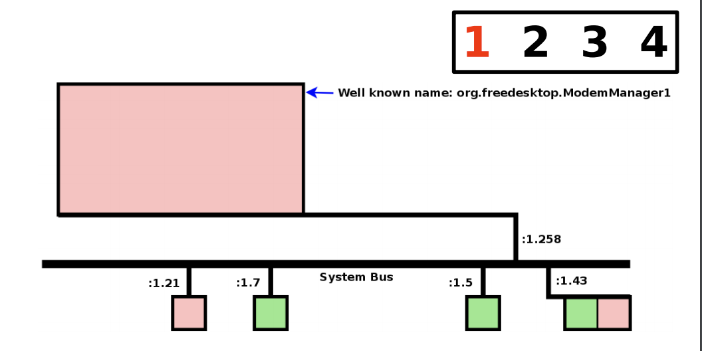
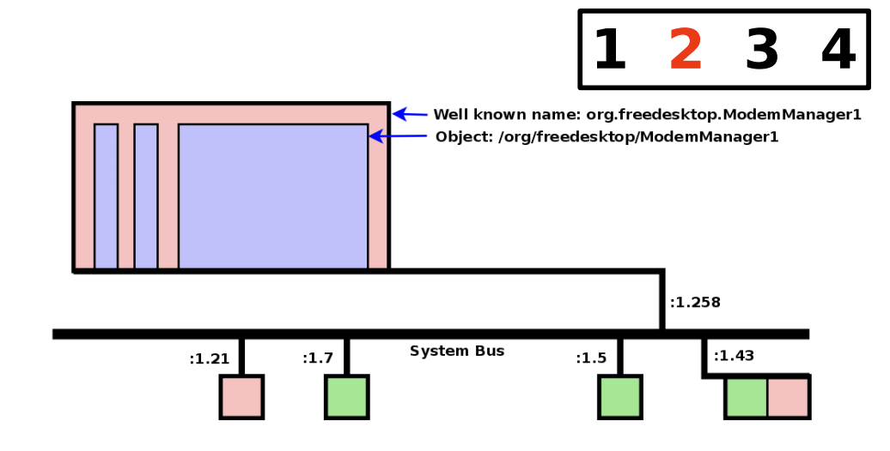
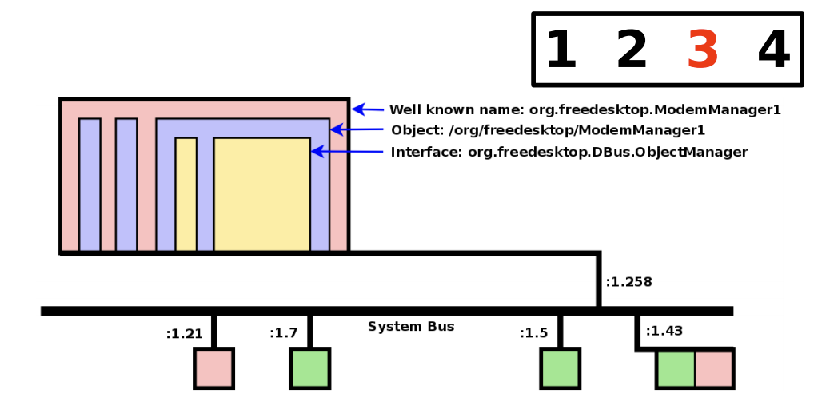
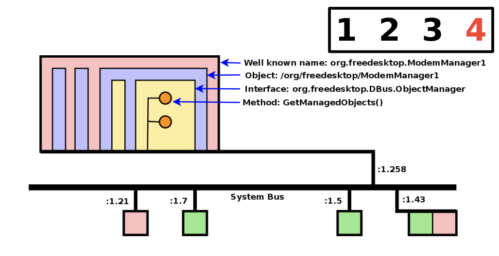
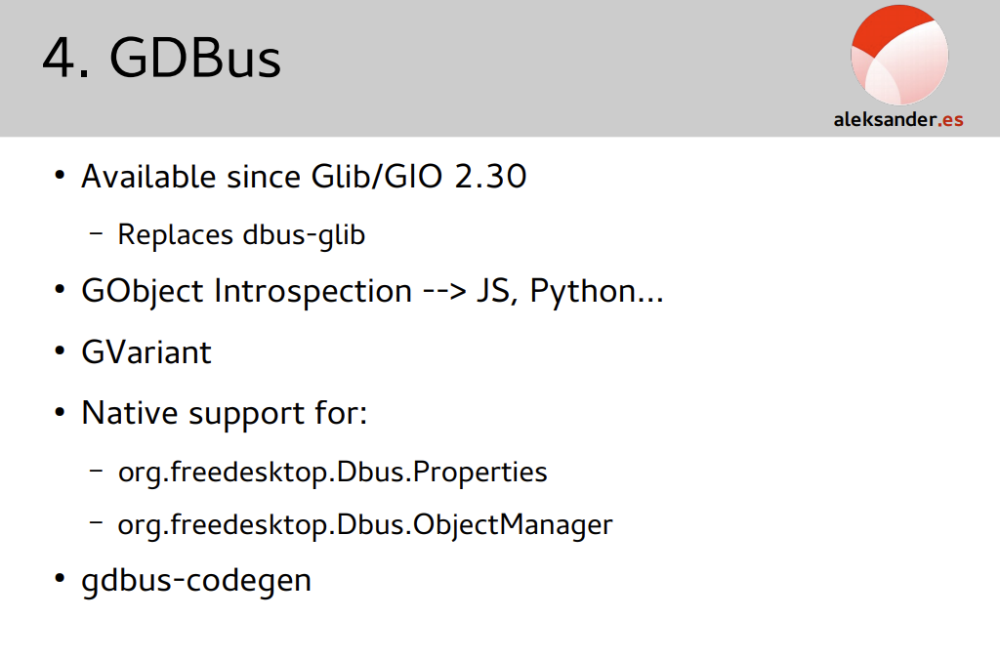

## dbus

### dbus 专有名词

- 本地对象(native objects):低级D-Bus不在乎，为了高级语言绑定与使用
- 对象路径(object paths):使同一个进程不同代码模块不会混淆
- 对象成员(method and signals):
    1. 方法:可以在对象上调用的操作，可以有输入和输出
    2. 信号:从对象广播信息传递到关心该信号的观察者那里，可能包含数据
- 接口(interfaces):
- 代理(proxies):代理对象是一种本地对象，方便在另一个进程调用。低级D-Bus需要创建方法调用消息，发送消息，然后手动接收和处理消息等过程。高级的API提供代理绑定替代以上操作。代理看起来像是一个普通的本地对象。但是挡在代理上调用方法时，会将其转换为DBus方法调用消息，等待消息，解压消息返回值，然后从本机方法返回。
    1. 无代理的代码
        ```c
        Message message = new Message("/remote/object/path", "MethodName", arg1, arg2);
        Connection connection = getBusConnection();
        connection.send(message);
        Message reply = connection.waitForReply(message);
        if (reply.isError()) {
        } else {
            Object returnValue = reply.getReturnValue();
        }        
        ```
    2. 有代理的代码
        ```c
        Proxy proxy = new Proxy(getBusConnection(), "/remote/object/path");
        Object returnValue = proxy.MethodName(arg1, arg2);
        ```
- 连接名(Bus Name):应用程序连到总线守护程序时, 守护程序立即为其分配一个名称, 此为连接名,连接名以':'开头, 此名称一旦分配, 那么在总线守护程序生命周期就会唯一的对应一个应用程序. 名称成功映射到某一程序,表示该程序连接成功. 当然程序中可用针对此名称定义另一个人类友好的名称使用. 连接名的作用:1. 名称唯一的确定一个连接; 2. 方便总线后台进程跟踪程序生命周期. 3.总线可用协调单例程序,确保系统只运行一个此应用实例.
- 地址: D-Bus 程序既可以时服务器,也可以是客户机. 服务器和客户端的区别只在连接时才重要. D-Bus 地址将确定服务端监听的位置和客户端要连接的位置.比如"unix:path=/tmp/abcdef". 当将D-Bus与消息总线守护进程一起使用的时候,libdbus通过读取环境变量自动发现每个会话总线守护进程的地址. 它通过检查一个总所周知的UNIX域套接字路径来发现系统范围的总线守护进程. 如果使用不带地址总线的D-Bus, 则由自己决定哪个程序是服务器,哪个是客户端,并为它们指定一种在服务器地址上达成一致的机制. 这种情况不多用.

> 将所有概念统一起来, 假设调用指定方法则是如下使用:
> 地址 -> [总线名/或称连接名] -> 对象路径 -> 接口 -> 方法
> 总线名可选是在没有总线守护进程使用的时候无须使用, 否则必须使用

- 消息: D-Bus通过在进程间发送消息来工作，若使用的是高级API, 消息可能会被API透明, 4种消息
    1. 方法调用的消息, 要求调用某对象的方法. 方法调用过程
        1.1 语言绑定可以提供代理, 以便在进程内对象上调用方法可以在另一个进程种调用远程对象上的方法. 如果是, 则应用程序调用代理上的方法, 代理构造方法调用消息并发送到远程.
        1.2 底层API, 应用程序可以自行构造方法调用消息,无序使用代理
        1.3 方法调用消息包含：远程进程的总线名、方法名、方法参数、对象路径、指定方法的接口名称(可选)
        1.4 调用消息的方法是发送到dbus的守护进程
        1.5 总线守护进程查找目标总线名称是否存在, 如果存在, 则总线守护进程将方法调用转达给该进程, 否则总线守护进程将创建一条错误消息并将其作为对方法调用的答复消息返回去
        1.6 接收放解包方法调用消息. 在低级API下, 它可以立即运行该方法并向总线守护进程发送方法应答消息. 如果是高级API, 会检查对象路径、接口、方法名, 将方法调用消息转为本地对象上的调用, 然后将此方法调用结果以消息的方式返回去.
        1.7 总线守护进程接收到方法应答消息并将其转发给方法调用的进程.
        1.8 调用的进程查看方法应答并使用应答种包含的返回值. 答复种还可能发生了错误. 使用绑定时可以将应答消息转为代理方法的返回值或异常.
    2. 方法返回消息, 返回调用方法的结果
    3. 错误消息, 返回由调用方法引起的异常
    4. 信号消息, 某给定信号已发出(事件): D-Bus种信号由单个消息组成, 由一个进程发送任意给任意数量的其它进程(信号是单向广播, 不具有返回值), 发送信号的人不知道信号的接受者, 是接收者向总线守护进程注册以接收感兴趣的信号, 轴线守护进程只将每个信号发送给对该信号感兴趣的接收者.具体流程如下:
        4.1 创建一个信号message,并将其发送到总线守护进程, 低级API需要手动完成, 高级API通过绑定完成
        4.2 信号消息包含指定信号的接口的名称, 信号名称, 发送信号的总线名称, 和参数
        4.3 消息总线上的任何进程都可以注册"匹配规则"以指示感兴趣的信号. 信号总线上有已注册"匹配规则"的列表
        4.4 总线守护程序检查信号并确定哪些进程对此信号感兴趣. 它将信号消息发送到这些进程
        4.5 接收信号的每个进程决定如何处理它, 如果使用绑定, 绑定可以选择在代理对象上发出本机信号. 如果使用低级API, 进程可以只查看信号发送方和名称, 并根据它决定要做什么.

> D-Bus对象可能支持 org.freedesktop.DBus.Introspectable 接口. 此接口有一个方法 Introspect, 它不接收参数并返回一个XML字符串, XML字符串描述对象的接口、方法和信号. 具体描述参看D-Bus 规范
> 总线守护进程不会对收到的消息进行排序之类的处理, 若一个进程向同一进程连续发送两条方法调用消息, 被调用方不用考虑调用顺序,和返回值顺序, 因为方法具有唯一序列号, 方法调用方使用此序列号应答消息与调用消息相匹配.






### D-Bus 协议介绍

- D-Bus具有低开销，因为它使用二进制协议，并且不必与XML之类的文本格式进行相互转换。因为D-Bus用于潜在的高分辨率同机IPC，而不是主要用于Internet IPC
- 基本D-Bus协议是一对一(对等或客户端-服务器)协议, 消息总线接收来自多个用用程序的连接, 并在其中转发消息.
- D-Bus的使用包括系统更改的通知(通知照相机何时插入计算机或已安装某些软件的新版本)或桌面互操作性，例如文件监视服务或配置服务。
- D-Bus设计用于两种特定用例

    1. 系统总线”，用于从系统到用户会话的通知，并允许系统请求来自用户会话的输入
    2. 用于实现桌面环境(例如GNOME和KDE)的“会话总线”。

#### 类型系统

> D-Bus具有类型系统，在该系统中，各种类型的值都可以以标准方式序列化在字节序列和对应值之间转换. 类型包含 *简单类型* 和 *复合类型*
> 基础类型分为 *固定长度类型* 和 *字符串类型*
>    - 固定长度类型:`BYTE` `BOOLEAN` `DOUBLE`  `NUIX_FD` `SIGNED`  `UNSIGNED INT`

- 固定类型

    | 类型名 | ascii 类型码 | 解释 |
    | --- | --- | --- |
    | `BYTE` | y(121) | 无符号8位整数 |
    | `BOOLEAN` | b(98) | 布尔值：0为false，1为true，编组格式允许的任何其他值无效 |
    | `INT16` | n(110) | 有符号(二进制补码)16位整数 |
    | `UINT16` | q(113) | 无符号16位整数 |
    | `INT32` | i(105) | 有符号(二进制补码)32位整数 |
    | `UINT32` | u(117) | 无符号32位整数 |
    | `INT64` | x(120) | 有符号(二进制补码)的64位整数(助记符：x和t是“ sixty”中的第一个字符，尚未用于更常见的功能) |
    | `UINT64` | t(116) | 无符号64位整数 |
    | `DOUBLE` | d(100) | IEEE 754双精度浮点 |
    | `UNIX_FD` | h(104) | 无符号的32位整数，表示文件描述符带外数组的索引，并通过某些平台特定的机制传输(助记符：h表示句柄) |

- 类字符串类型: 是具有可变长度的基本类型。从概念上讲，任何类似字符串的类型的值都为0或多个以UTF-8编码的Unicode代码点。类字符串类型的编组格式都以单个零（NUL）字节结尾，但是该字节不被视为文本的一部分

- 类字符串类型的特征

| 类型 | ascii 类型码 | 解释 |
| --- | --- | --- |
| `STRING` | s(115) | 没有额外的限制 |
| `OBJECT_PATH` | o(111) | 必须是 语法上有效的对象路径 |
| `SIGNATURE` | g(103) | 零个或多个单一完整类型 |

- 有效对象路径
- 有效签名
- 容器类型
   - `STRUCT` --- (ii) 可以潜逃结构 (i(ii)) 
   - `ARRAY` --- "ai" a表示数组, 后边必须根一个完整的类型 a(ii) 表示32为整数数组
   - `VARIANT`
   - `DICT_ENTRY`

- dbus 完整的类型

| Category | Conventional Name | Code | Description |
| --- | --- | --- | --- |
| reserved INVALID | 0(ASCII NUL) | Not a valid type code, used to terminate signatures |
| fixed, basic | BYTE | 121(ASCII 'y') | 8-bit unsigned integer |
| fixed, basic | BOOLEAN | 98(ASCII 'b') | Boolean value, 0 is FALSE and 1 is TRUE. Everything else is invalid. |
| fixed, basic | INT16 | 110 (ASCII 'n') | 16-bit signed integer |
| fixed, basic | UINT16 | 113 (ASCII 'q') | 16-bit unsigned integer |
| fixed, basic | INT32 | 105 (ASCII 'i')	 | 32-bit signed integer |
| fixed, basic | UINT32 | 117 (ASCII 'u') | 32-bit unsigned integer |
| fixed, basic | INT64 | 120 (ASCII 'x') | 64-bit signed integer |
| fixed, basic | UINT64 | 116 (ASCII 't') | 64-bit unsigned integer |
| fixed, basic | DOUBLE | 100 (ASCII 'd') | IEEE 754 double |
| string-like, basic | STRING | 115 (ASCII 's') | UTF-8 string (must be valid UTF-8). Must be nul terminated and contain no other nul bytes.|
| string-like, basic | OBJECT_PATH | 111 (ASCII 'o') | Name of an object instance |
| string-like, basic | SIGNATURE | 103 (ASCII 'g') | A type signature |
| container | ARRAY | 97 (ASCII 'a') | Array |
| container | STRUCT | 114 (ASCII 'r'), 40 (ASCII '('), 41 (ASCII ')') | Struct; type code 114 'r' is reserved for use in bindings and implementations to represent the general concept of a struct, and must not appear in signatures used on D-Bus. |
| container | VARIANT | 118 (ASCII 'v')	| Variant type (the type of the value is part of the value itself) |
| container | DICT_ENTRY | 101 (ASCII 'e'), 123 (ASCII '{'), 125 (ASCII '}') | Entry in a dict or map (array of key-value pairs). Type code 101 'e' is reserved for use in bindings and implementations to represent the general concept of a dict or dict-entry, and must not appear in signatures used on D-Bus. |
| fixed, basic | UNIX_FD | 104 (ASCII `'h'`) | Unix file descriptor |
| reserved | (reserved) | 109 (ASCII `'m'`) | Reserved for a 'maybe' type compatible with the one in GVariant, and must not appear in signatures used on D-Bus until specified here |
| reserved | (reserved) | 42 (ASCII `'*'`) | Reserved for use in bindings/implementations to represent any single complete type, and must not appear in signatures used on D-Bus. |
| reserved | (reserved) | 63 (ASCII `'?'`) | Reserved for use in bindings/implementations to represent any basic type, and must not appear in signatures used on D-Bus. |
| reserved | (reserved) | 64 (ASCII `'@'`), 38 (ASCII '&'), 94 (ASCII '^') | Reserved for internal use by bindings/implementations, and must not appear in signatures used on D-Bus. GVariant uses these type-codes to encode calling conventions. |

> 未完 待续 ...

### GDBus

#### GDBus与dbus-glib差距

- dbus-glib使用libdbus实现, GDBus依赖于GIO流作为传输层, 并有自己的实现来进行D-Bus 连接设置和身份验证. GDBus还解决了一些多线程问题.
- dbus-glib使用GObject类型系统来获取方法参数和返回值, GDBus依赖于明确为D-Bus类型设计的GVariant类型系统.
- dbus-glib只对D-Bus接口建模, 不为对象提供任何类型. GDBus对D-Bus接口通过GDBusInterface、GDBProxy和GDBusInterfaceSkeleton类型和对象(通过GDBusObject、GDBusObjectSkeleton和GDBusObjectProxy类型)进行建模
- GDBus 包括对`org.freedesktop.DBus.Properties`(通过`GDBusProxy`类型)和`org.freedesktop.DBus.ObjectManager` D-Bus接口的本地支持, 而dbus-glib不支持
- dbus-glib中导出对象的典型方法包括使用dbus-binding-tool从XML数据生成代码, GDBus提供了类似工具gdbus-codegen用来生成D-Bus接口文档
- dbus-glib不提供任何遍历API来拥有和查看总线名称, GDBus提供了g_bus_own_name() 和 g_bus_watch_name() 系累功能
- GDBus 提供了API来解析、生成和使用 'Introspection XML', dbus-glib 没有




### 参考文档

- [dbus协议介绍](https://dbus.freedesktop.org/doc/dbus-specification.html)
- [dbus 守护进程](https://dbus.freedesktop.org/doc/dbus-daemon.1.html)
- [dbus低级API文档](https://dbus.freedesktop.org/doc/api/html/index.html)
- [dbus低级API](https://dbus.freedesktop.org/doc/api/html/annotated.html)
- [dbus简介](https://dbus.freedesktop.org/doc/dbus-tutorial.html)
- [gdbus使用](https://developer.gnome.org/gio/stable/gdbus-convenience.html)
- [python dbus](https://dbus.freedesktop.org/doc/dbus-python/tutorial.html)
- [qt dbus](http://qt-project.org/doc/qt-5/qtdbus-index.html)

