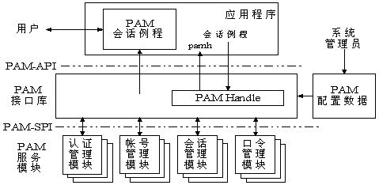
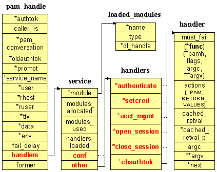
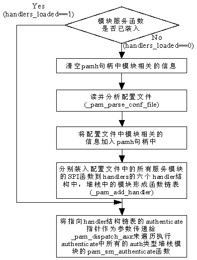

## PAM

> PAM 可插拔认证模块，设计初衷是将不同的底层认证机制集中到一个高层的API中。免去应用程序中进行认证逻辑。

### PAM 概述

#### PAM 的认证类别(type)

- account: 在用户能不能使用某服务上具有发言权，但不负责身份认证。比如，account 这个 type 可以检查用户能不能在一天的某个时间段登录系统、这个用户有没有过期、以及当前的登录用户数是否已经饱和等等。通常情况下，在登录系统时，如果你连 account 这个条件都没满足的话，即便有密码也还是进不去系统的。
- auth: 一般来说，询问你密码的就是这个 type。假如你的验证方式有很多，比如一次性密码、指纹、虹膜等等，都应该添加在 auth 下。auth 做的另外一件事情是权限授予，比如赋给用户某个组的组员身份等等。
- password: 主要负责和密码有关的工作。修改密码的时候有时会提示“密码不够长”、“密码是个常用单词”之类的，就是在这里设置的。在这里还设置了保存密码时使用了哪种加密方式（比如现在常用的 SHA-512）。请注意，这里的密码不局限于 /etc/shadow 中的密码，有关认证 token 的管理都应该在此设置：如果你使用指纹登录 Linux，在设置新指纹时，如果希望首先验证这是人的指纹而不是狗的指纹，也应该放在这里。
- session: 一个“忙前忙后”的 type，它要在某个服务提供给用户之前和之后做各种工作。比如用户登录之前要将用户家目录准备好，或者在用户登录之后输出 motd 等等

#### PAM 配置

> 模块文件路径`/lib/security`或`/lib64/security`以动态库形式存在，取决于操作系统的位数。
> 配置文件路径:`/etc/pam.d/`和`/etc/pam.conf`。`/etc/pam.d/`存在，则忽略`/etc/pam.conf`

- 配置格式:
1. 服务名称就是PAM配置文件名
    ```
    工作类别        控制模式        模块路径        模块参数
    ```
2. 每一条前的'-'短线，表示若找不到模块导致无法被加载时，不会被记录在日志中
3. 工作类别、流程栈、控制模式
    - 工作类别: -
    - 流程栈: 它是认证时执行步骤和规则的堆叠。在某个服务的配置文件中，它体现在了配置文件中的自上而下的执行顺序中。栈是可以被引用的，即在一个栈（或者流程）中嵌入另一个栈。
    - 控制模式: 用于定义各个认证模块在给出各种结果时 PAM 的行为，或者调用在别的配置文件中定义的认证流程栈。该列有两种形式，一种是比较常见的“关键字”模式，另一种则是用方括号（[]）包含的“返回值=行为”模式。
4. 控制模式——关键字模式下
    ```
    session    include      postlogin
    -session   optional     pam_ck_connector.so
    ```
    - required: 本条没有满足，本次认证一定失败，但是认证过程不因此打断。整个栈运行结束后返回失败信号
    - requisite: 本条没满足，认证失败，终止整个栈并返回。
    - sufficient: 本条满足，且之前没有任何失败，则返回“认证成功”，若本条验证失败，则不对结果产生影响。
    - optional: 仅在整个栈中只有一个条目时才起作用，否则不起作用。
    - include: 将其它配置文件中的流程栈包含到当前未知
    - substack: 运行其它配置文件中的流程，并将整个运行结果作为该行的结果输出。同include区别：类似宏函数与函数的调用区别。
5. 控制模式——“"返回值=行为"模式
    ```c
    [value1=action1 value2=action2 ...]
    ```
 > 其中，valueN 的值是各个认证模块执行之后的返回值。有 success、user_unknown、new_authtok_reqd、default 等等数十种。其中，default 代表其他所有没有明确说明的返回值。返回值结果清单可以在 /usr/include/security/_pam_types.h 中找到，也可以查询 pam(3) 获取详细描述。

    - ignore：在一个栈中有多个认证条目的情况下，如果标记 ignore 的返回值被命中，那么这条返回值不会对最终的认证结果产生影响。
    - bad：标记 bad 的返回值被命中时，最终的认证结果注定会失败。此外，如果这条 bad 的返回值是整个栈的第一个失败项，那么整个栈的返回值一定是这个返回值，后面的认证无论结果怎样都改变不了现状了。
    - die：标记 die 的返回值被命中时，马上退出栈并宣告失败。整个返回值为这个 die 的返回值。
    - ok：在一个栈的运行过程中，如果 ok 前面没有返回值，或者前面的返回值为 PAM_SUCCESS，那么这个标记了 ok 的返回值将覆盖前面的返回值。但如果前面执行过的验证中有最终将导致失败的返回值，那 ok 标记的值将不会起作用。
    - done：在前面没有 bad 值被命中的情况下，done 值被命中之后将马上被返回，并退出整个栈。
    - N（一个自然数）：功效和 ok 类似，并且会跳过接下来的 N 个验证步骤。如果 N = 0 则和 ok 完全相同。
    - reset：清空之前生效的返回值，并且从下面的验证起重新开始。
    
> 实际上，“关键字”模式可以等效地用“返回值=行为”模式来表示。具体的对应如下：
> - required：
>   [success=ok new_authtok_reqd=ok ignore=ignore default=bad]
> - requisite：
>   [success=ok new_authtok_reqd=ok ignore=ignore default=die]
> - sufficient：
>   [success=done new_authtok_reqd=done default=ignore]
> - optional：
>   [success=ok new_authtok_reqd=ok default=ignore]

6. 模块参数

    模块参数用空格与模块路径相隔。该参数将只和特定模块相关，因此某个模块的文档中一定包含其参数的信息。如果需要在单个参数中使用空格，可以将整个参数用方括号（[]）包裹起来。

#### PAM 架构

1. PAM框架结构图

> 系统管理员通过PAM配置文件来制定不同应用程序的不同认证策略；应用程序开发者通过在服务程序中使用PAM API(pam_xxxx( ))来实现对认证方法的调用；而PAM服务模块的开发者则利用PAM SPI来编写模块（主要是引出一些函数pam_sm_xxxx( )供PAM接口库调用），将不同的认证机制加入到系统中；PAM接口库（libpam）则读取配置文件，将应用程序和相应的PAM服务模块联系起来



2. PAM 接口库源代码分析

> pam_handle和其他几个主要的数据结构（见../libpam/pam_private.h）及其之间的关系如下图所示



其中pam_handle包含认证的用户的token、用户名、应用程序名、终端名等信息，以及一个service结构。service结构包含服务模块的相关信息，各个域的含义是：

- module--该结构包含装载的模块的名字、类型（静态或动态模块）、链接句柄（装载模块时的句柄）
- modules_allocated--分配的模块数。
- modules_used--已使用的模块数。
- handlers_loaded--是否对操作(handlers结构)进行了初始化，handlers结构和初始化handlers见下面的介绍。

    | handle指针 | API 函数 | SPI函数 |
    | --- | --- | --- |
    | authenticate | pam_authenticate() | pam_sm_authenticate() |
    | setcred | pam_setcred() | pam_sm_setcred() |
    | acct_mgmt | pam_acct_mgmt() | pam_sm_acct_mgmt() |
    | open_session | pam_open_session() | pam_sm_open_session() |
    | close_session | pam_close_session() | pam_sm_close_session() |
    | chauthtok | pam_chauthtok() | pam_sm_chauthtok() |

    handler数据结构是最直接保存服务模块的SPI服务函数的地址及参数的结构，其包含的主要的域的含义如下：
    1. `(*func)`   该函数指针指向handlers所装载的服务模块的服务函数。
    2. `argc`、`**argv`   分别为`*func`所指向的函数的参数个数和参数列表。
    3. `*next`    指向堆栈模块中的下一个服务模块的服务函数。由此指针形成所有堆栈模块的服务函数链。

- conf--由应用程序相对应的配置文件指定的服务模块的handlers。
- other--为缺省配置文件指定的服务模块的handlers。

3. PAM认证 API 的实现

> 以下为 pam_authenticate 函数执行流程图。其他的认证API函数（pam_open_session等）执行过程前面五个步骤同上图，只是在最后一步时传递给_pam_dispatch_aux的指针参数不同，传递3.1节表中每个API函数相对应的那个handler型指针，然后执行相对应的SPI服务函数链。



### PAM 模块开发

1. Linux-PAM(Linux 的可插入身份验证模块)是一个 library，使本地系统管理员可以选择各个 applications 对用户进行身份验证的方式。
2. 在编写基于 PAM 的 application 时，必须以对 application 透明的方式提供这些服务。也就是说，在编写 application 时，不能对 client 的身份验证进行任何假设。
3. 认证的 process 由 PAM library 通过调用`pam_authenticate()`来执行。此 function 的 return value 将指示命名的 client(用户)是否已通过身份验证。
4. 如果 PAM library 需要提示用户输入任何信息，例如他们的 name 或密码，那么它将这样做。如果将 PAM library 配置为使用某种静默协议对用户进行身份验证，它也会这样做。 (后一种情况可能是通过 example.)的某些硬件接口。重要的是要注意，PAM library 有权决定 application 必须决定何时提示用户的所有决定
5. PAM library 对于不同风格的 application 必须同样有效。比如：字符界面和图形界面
6. application 为 PAM library 提供了对话功能。从 PAM library 内部调用此 function，并使 PAM 可以直接与 client 进行交互。该对话功能必须要做的事情是提示用户输入文本 and/or 来从用户那里获取文本输入，以供 PAM library 处理。稍后部分中将提供此功能的详细信息。
7. PAM 够通过调用`pam_setcred()`设置和删除用户凭据。在用户经过身份验证之后，并在向用户提供服务之前，应始终调用此 function。
8. 用户账户是否已过期 `pam_chauthtok()`
9. 会话`pam_open_session()`和`pam_close_session()`

#### PAM 模块API功能一览

1. 获取和设置 PAM ITEM 和 数据

    ```
    /**
     * pam_handle_t *pamh;
     * const char *module_data_name;
     * void *data;
     * void (*cleanup)(pam_handle_t *pamh, void *data, int error_status);
     */
    int pam_set_data (pamh, module_data_name, data, (*cleanup)(pam_handle_t* pamh, void* data, int error_status));

    /**
     * const pam_handle_t *pamh;
     * const char *module_data_name;
     * const void **data;
     */
    int pam_get_data (pamh, module_data_name, data);
    ```

    - `pam_set_item` 允许程序和PAM服务模块更新 item_type 的PAM信息
    - `pam_get_item` 允许程序和PAM服务模块访问 item_type 的PAM信息

        | set/get宏 | 说明 |
        | --- | --- |
        | `PAM_SERVICE` | 服务名 |
        | `PAM_USER` | 提供身份服务的实体用户名 |
        | `PAM_USER_PROMPT` | 提示用户输入 name 时使用的 string。此string的默认值是 'login:' 的本地化 |
        | `PAM_TTY` | 终端名，如果是设备文件，则以`/dev/`为前缀，对于图形界面，此值是 $DISPLAY 变量 |
        | `PAM_RUSER` | 请求用户名，本地请求用户的本地名或远程请求用户的远程名 |
        | `PAM_RHOST` | 正在请求的主机名 |
        | `PAM_AUTHTOK` | 认证令牌（通常是密码）。除`pam_sm_authenticate()` 和 `pam_sm_chauthok()`外，所有模块功能都应该忽略此令牌 |
        | `PAM_OLDAUTHTOK` | 旧的身份令牌。除`pam_sm_chauthtok`外所有模块都应该忽略此令牌 |
        | `PAM_CONV` | `pam_conv` 结构 |
        | `PAM_FAIL_DELAY` | 用于重定向集中管理的故障延迟 (特定Linux-PAM) |
        | `PAM_XDISPLAY` | X显示的名称 （特定Linux-PAM）|
        | `PAM_XAUTHDATA` | 指向包含X认证数据结构的指针，该数据需要与 `PAM_XDISPLAY` 指定的显示器建立连接。`pam_xauth_data()` （特定Linux-PAM）|
        | `PAM_AUTHTOK_TYPE` | 默认操作是在请求密码时使用以下提示： "New UNIX password:" 和 "Retype UNIX password:"默认情况下未空`pam_get_authtok`（特定Linux-PAM）|

    - 返回值
        | 返回宏 | 说明 |
        | --- | --- |
        | PAM_BAD_ITEM | application尝试设置未定义或无法访问的item |
        | PAM_BUF_ERR | 内存缓冲区错误 |
        | PAM_SUCCESS | 数据更新成功 |
        | PAM_CONV_ERR | 应用程序提供的对话方法无法获取用户名 |
        | PAM_SYSTEM_ERR | 作为第一个参数传递的 `pam_handle_t` |

2. PAM对话

    - PAM库使用应用程序定义的回调来允许已加载的模块和应用程序之间的直接通信。该回调由 事务开始时传递给 `pam_start()` 的 `struct pam_conv` 指定 
    - 当模块调用引用的`conv()`函数时，参数`appdata_ptr`设置为该结构的第二个元素。
    - `num_msg`: 持有指针数组msg的长度。成功返回之后，指针resp指向`pam_response`结构的数组，其中包含应用程序提供的文本。调用要使用 free() 释放此数组和响应本身

    - 消息的类型，由`struct pam_message`的`msg_style`成员指定

        | 类型 | 解释 |
        | --- | --- |
        | `PAM_PROMPT_ECHO_OFF` | 获取字符串而不回显任何文本 |
        | `PAM_PROMPT_ECHO_ON` | 回显文本的同时获取字符串 |
        | `PAM_ERROR_MSG` | 显示错误信息 |
        | `PAM_TEXT_INFO` | 显示一些文字 |


```c
#include <security/pam_appl.h>

struct pam_message {
    int msg_style;
    const char *msg;
};

struct pam_response {
    char *resp;
    int resp_retcode;
};

struct pam_conv {
    int (*conv)(int num_msg, const struct pam_message **msg,
                struct pam_response **resp, void *appdata_ptr);
    void *appdata_ptr;
};
```


- 头文件

```c
#include <security/pam_appl.h>      /* 核心库 */
#include <security/pam_misc.h>      /* 杂项函数库 */
```

- 编译

```c
cc -o application .... -lpam -lpam_misc
```

### PAM 事务处理

1. `pam_start`开始事务

    - `pam_start` 函数创建 PAM context 并启动 PAM transaction。
    - servicename 参数指定要应用的服务的 name，并将作为 `PAM_SERVICE` item 存储在新的 context 中。该服务的 policy 将从文件`/etc/pam.d/service_name`中读取，或者如果该文件不存在，则从`/etc/pam.conf`中读取。
    - user 参数可以指定目标用户的 name 并将存储为 `PAM_USER` item。如果参数为 NULL，则模块必须在需要时询问此 item。
    - `pam_conversation` 参数指向描述要使用的对话 function 的结构 `pam_conv`。 application 必须提供此功能，以便在已加载的模块和 application 之间进行直接通信。
    - 成功执行 `return(PAM_SUCCESS)`之后，pamh 的内容是一个句柄，其中包含用于 PAM 函数的连续call 的` PAM context`。错误的情况是 pamh 的内容未定义。
    - `pam_handle_t` 是一个盲目结构，application 不应尝试直接对其进行探测以获取信息。相反，PAM library 提供功能 `pam_setitem(3)`和 `pam_getitem(3)`。 PAM 句柄不能与 long 相同的 time 上用于多重身份验证，因为之前没有调用`pam_end`。
    - 返回值
        - `PAM_ABORT` 一般失败
        - `PAM_BUF_ERR` 内存缓冲区错误
        - `PAM_SUCCESS` 事务成功
        - `PAM_SYSTEM_ERR` 系统错误，比如空指针错误

    ```c
    #include <security/pam_appl.h>
    int pam_start(service_name, user, pam_conversation, pamh);
   
    const char *service_name;
    const char *user;
    const struct pam_conv *pam_conversation;
    pam_handle_t **pamh;
    ```
2. `pam_end`终止事务

    - `pam_end`终止PAM事务，返回后，句柄不再生效，与之关联的所有内存失效。
    - `pam_status` 上次PAM library 调用返回给 application 的 value。`pam_status` 接受的 value 用作模块特定的回调 `function cleanup()`(请参见 `pam_set_data()`和 `pam_get_data()`)的参数。

    ```c
    #include <security/pam_appl.h>
    int pam_end(pamh, pam_status);
   
    pam_handle_t *pamh;
    int pam_status;
    ```

3. `pam_set_item`设置

    - `pam_set_item` 功能允许 applications 和 PAM 服务模块访问和更新 `item_type` 的 PAM 信息。为此，将创建 item 参数指向的 object 的副本。支持以下 `item_types`：

        - PAM_SERVICE 服务名
        - PAM_USER 提供身份服务的实体用户名
        - PAM_USER_PROMPT 提示用户输入 name 时使用的 string。此string的默认值是 'login:' 的本地化
        - PAM_TTY 终端名，如果是设备文件，则以`/dev/`为前缀，对于图形界面，此值是 $DISPLAY 变量
        - PAM_RUSER 请求用户名，本地请求用户的本地名或远程请求用户的远程名
        - PAM_RHOST 正在请求的主机名
        - PAM_AUTHTOK 认证令牌（通常是密码）。除`pam_sm_authenticate()` 和 `pam_sm_chauthok()`外，所有模块功能都应该忽略此令牌
        - PAM_OLDAUTHTOK 旧的身份令牌。除`pam_sm_chauthtok`外所有模块都应该忽略此令牌
        - PAM_CONV pam_conv结构
        - PAM_FAIL_DELAY 用于重定向集中管理的故障延迟 (特定Linux-PAM)
        - PAM_XDISPLAY X显示的名称 （特定Linux-PAM）
        - PAM_XAUTHDATA 指向包含X认证数据结构的指针，该数据需要与 PAM_XDISPLAY 指定的显示器建立连接。`pam_xauth_data()` （特定Linux-PAM）
        - PAM_AUTHTOK_TYPE 默认操作是在请求密码时使用以下提示： "New UNIX password:" 和 "Retype UNIX password:"默认情况下未空`pam_get_authtok`（特定Linux-PAM）
    - 返回值
        - PAM_BADITEM application尝试设置未定义或无法访问的item
        - PAM_BUF_ERR 内存缓冲区错误
        - PAM_SUCCESS 数据更新成功
        - PAM_SYSTEM_ERR 作为第一个参数传递的 `pam_handle_t`
    > 对于 PAM_CONV 和 PAM_FAIL_DELAY 之外的所有 item_type，item是指向<nul>终止字符的指针，在 PAM_CONV 的情况下，item指向已初始化的 pam_conv 结构，在PAM_FAIL_DELAY的情况下，item是function指针
    > `void (*delay_fn)(int retval, unsigned usec_delay, void* appdata_ptr)`
    > PAM_RUSER@PAM_RHOST 应始终标识发出请求的用户。某些情况下 PAM_RUSER 可能为NULL

    ```c
    #include <security/pam_modules.h>
    int pam_set_item(pamh, item_type, item);

    pam_handle_t *pamh;
    int item_type;
    const void *item;
    ```
4. `pam_get_item`

    - 可获取的值
        
        - PAM_SERVICE
        - PAM_USER
        - PAM_USER_PROMPT
        - PAM_TTY
        - PAM_RUSER
        - PAM_RHOST
        - PAM_AUTHTOK
        - PAM_OLDAUTHTOK
        - PAM_CONV
        - PAM_FAIL_DELAY
        - PAM_XDISPLAY
        - PAM_XAUTHDATA
        - PAM_AUTHTOK_TYPEA

    - 返回值

        - PAM_BADITEM
        - PAM_BUF_ERR
        - PAM_PERM_DENIED
        - PAM_SUCCESS
        - PAM_SYSTEM_ERR

    ```c
    #include <security/pam_modules.h>
    int pam_get_item(pamh, item_type, item);
 
    const pam_handle_t *pamh;
    int item_type;
    const void **item;
    ```

5. PAM 错误相关字符串

    - `pam_strerror` 函数返回指向 string 的指针，该指针描述了在参数 errnum 中传递的错误 code，可能使用当前 locale 的 `LC_MESSAGES` 部分来 select 适当的语言。 application 不得修改此 string。没有 library function 会修改此 string。

    ```c
    #include <security/pam_appl.h>
    const char *pam_strerror(pamh, errnum);
    
    pam_handle_t *pamh;
    int errnum;
    ```

6. `pam_fail_delay` 程序或模块可以通过此机制建议 usec micro-secinds 的最小延迟

    - 与成功无关，当 PAM 服务模块将控制权交还给 application 时，延迟 time 重置为其默认的零值
    - 在调用所有身份验证模块之后，但在将控制权返回给服务 application 之前，将发生延迟。

    ```c
    #ifdef HAVE_PAM_FAIL_DELAY
        ....
    #endif /* HAVE_PAM_FAIL_DELAY */
    ```

7. `pam_authenticate` 验证用户

    - `pam_authenticate` 功能用于验证用户。要求用户根据身份验证服务提供身份验证令牌，通常这是密码，但也可以是指纹。
    - PAM 服务模块可以通过对话机制(请参见 `pam_start()`和 `pam_conv()`)来请求用户输入其用户名。经过身份验证的用户的 name 将出现在 PAM item `PAM_USER` 中。这个 item 可以通过调用 `pam_getitem( `来恢复。
    - pamh 参数是通过对 `pam_start()` 的先前调用获得的身份验证句柄。 flags 参数是二进制值或以下值的零个或多个：

        - PAM_SILENT: 不要发出任何消息
        - PAM_DISALLOW_NULL_AUTHTOK: 如果用户没有注册的身份验证令牌，则PAM模块服务应 return PAM_AUTH_ERR

    ```c
    #include <security/pam_appl.h>
    int pam_authenticate(pamh, flags);

    pam_handle_t *pamh;
    int flags;
    ```
8. `pam_setcred` 设置用户凭证
    
    - `pam_setcred` 功能用于建立，维护和删除用户的凭证。在对用户进行身份验证之后和为用户打开 session(使用 `pam_opensession()`))之前，应调用它来设置凭据。在 session 关闭(使用 `pam_closesession())`)之后，应删除凭据。

    - `PAM_ESTABLISH_CRED` 初始化用户凭据
    - `PAM_DELETE_CRED` 删除用户凭据
    - `PAM_REINITIALIZE_CRED` 完全重新初始化用户的凭据
    - `PAM_REFRESH_CRED` 延长现有凭证的寿命

    - 返回值
        
        - `PAM_BUF_ERR` 内存缓存区错误
        - `PAM_CRED_ERR` 设置用户凭证失败
        - `PAM_CRED_EXPIRED` 用户凭证已过期
        - `PAM_CRED_UNAVAIL` 无法检索用户凭证
        - `PAM_SUCCESS` 数据成功存储
        - `PAM_SYSTEM_ERR` 系统错误，控指针
        - `PAM_USER_UNKNOWN` 用户验证未知模块用户

    ```c
    #include <security/pam_appl.h>
    int pam_setcred(pamh, flags);

    pam_handle_t *pamh;
    int flags;
    ```
9. `pam_acct_mgmt` 用户账户是否有效

    - 检查身份验证令牌和账户到期并验证访问限制。常在用户通过身份验证后调用。

10. `pam_chauthtok` 更新身份验证令牌

11. `pam_open_session`成功通过身份验证的用户设置用户会话
12. `pam_close_session` 关闭用户会话
13. `pam_putenv` 设置PAM环境变量
14. `pam_getenv` 获取PAM环境变量
15. `pam_getenvlist`返回与句柄pamh有关的PAM环境的完整副本
16. `misc_conv` 基于文本的对话功能
17. `pam_misc_past_env` 将环境复制到 PAM 环境
18. `pam_misc_drop_env` 释放本地保存的环境
19. `pam_misc_setenv` BSD之类的PAM环境变量设置

### 文档

- [文档](http://v.colinlee.fish/posts/pam-tutorial-1-intro.html)
- [文档](https://www.docs4dev.com/docs/zh/linux-pam/1.1.2/reference/adg-interface-by-app-expected.html)
